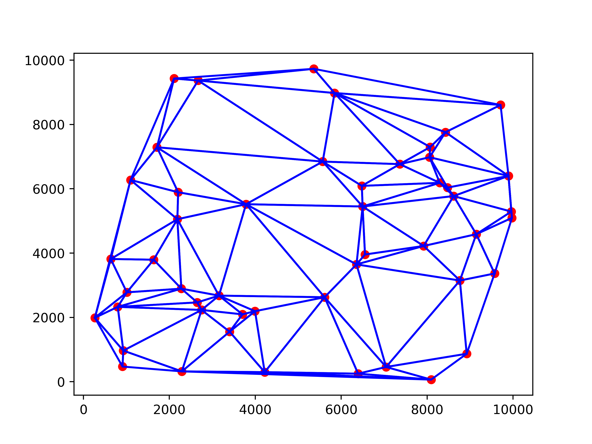

# Delaunay Triangulation (WORK IN PROGRESS)

**TODO:**
- [X] Brute Force
- [X] Incremental (Bowyer–Watson)
- [X] Divide and Conquer (Guibas and Stolfi)
- [ ] Benchmark

## Getting Started
### Prerequisites
Ensure you have `python3` and `pip` installed on your machine. Then, install the necessary dependencies:
```
pip install -r requirements.txt
```
### Running the Scripts
To generate the images and performance data, execute the provided shell script:
```
./run.sh
```
**NOTE**: See `main.py` for possible arguments and `run.sh` for examples of how to use them.

## Sample Output


